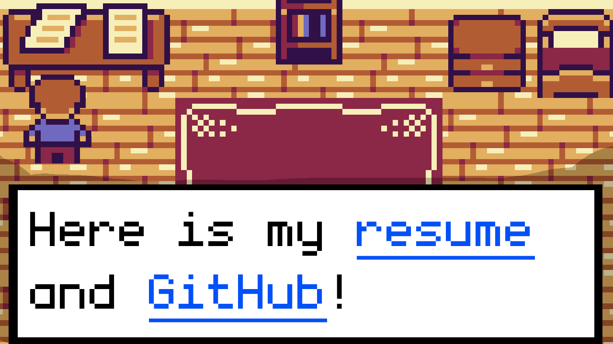

# Daniel's Personal Portfolio 2D Game

Interective Portfolio were the agent can be moving around the map and explore the different parts of the 
map and consult them and view my CV, experience, etc.

Live Demo : https://theraddani.github.io/Portfolio/

# How to run

Note: You need `Node.js` and `npm` installed on your machine.

`npm install` then `npm run dev`

# How to build

`npm run build` and a dist folder should be created.

# How to preview the build

`npm run preview`

# How to host?

Here is a [guide](HOW_TO_DEPLOY.MD).
